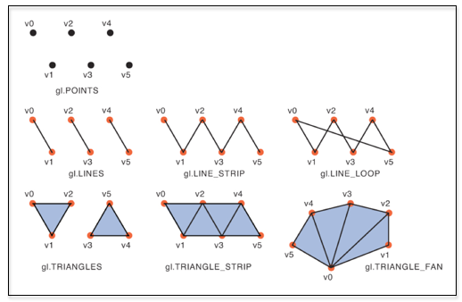
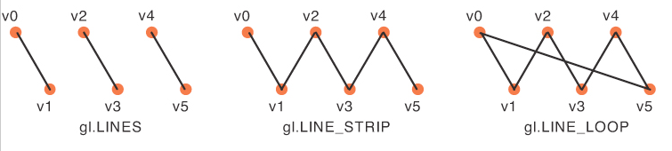

# OpenGL Modes

## Points / Lines / Triangles

## Lines in Detail

WebGL supports the rendering of lines. This is useful if you want to draw a wireframe rendering of your model, or outline a face with a border or highlight.

In WebGL you always define one or more lines using an array of vertices. There are three different ways the vertices can be used to form lines, as shown in the diagram below. The options are:

- LINES - Two vertices for each line. If a vertex is needed for multiple lines, it must be repeated in the vertices array. Defining n lines requires 2n vertices.
- LINE_STRIP - After the initial two vertices, each additional vertex defines one more line. Defining n lines requires (n + 1) vertices.
- LINE_LOOP - Identical to LINE_STRIP with the addition of a line that connects the first and last vertex. Defining n lines requires n vertices.

# Examples

## Point
<GL script="modes" :args="['points']"/>

## Triangle (using triangles to draw a circle )
<GL script="modes" :args="['triangle']"/>

## Line-Strip
<GL script="modes" :args="['lines-strip']"/>

::: code-group

<<< @/src/scripts/modes/index.ts{ts}[Main]
<<< @/src/scripts/modes/shader/shader.frag{glsl}[Fragment Shader]
<<< @/src/scripts/modes/shader/shader.vert{glsl}[Vertex Shader]

:::
